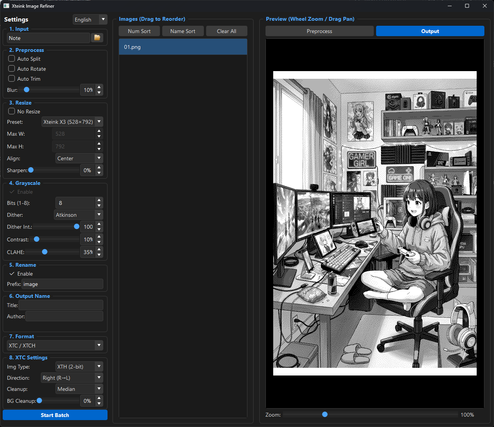

# Xteink Image Refiner

<p align="center">
  
</p>

**[日本語版 README はこちら](README_jp.md)**

A desktop application for optimizing and converting manga and scanned images for e-book readers, especially Xteink e-paper devices.

## Features

- **Flexible input**: Load from folders, ZIP archives, or individual image files. Supports adding multiple sources
- **Image processing pipeline**: Margin trimming → Auto-rotate → Blur → Resize → Sharpen → Grayscale → CLAHE → Contrast → Dithering → Cleanup
- **Multiple output formats**: JPEG / PNG (folder, ZIP, CBZ), EPUB3, XTC / XTCH (Xteink proprietary formats)
- **Real-time preview**: Inspect processed results with zoom & pan. Toggle between preprocess / output modes
- **Auto margin detection & manual adjustment**: Drag crop handles to fine-tune
- **Auto split**: Automatically split spread pages into two based on aspect ratio
- **Dithering**: Floyd-Steinberg / Atkinson / Sauvola algorithms (1-bit / 2-bit / 8-bit)
- **Device presets**: Built-in resolution presets for Xteink X3 (528x792), X4 (480x800), and M5Paper S3 (540x960)
- **Save per folder**: Batch mode — each source folder produces its own output file with auto-numbered names
- **No-resize mode**: For sorting, renaming, and packing images without resizing
- **Auto metadata extraction**: Parses `[Author] Title` from folder/ZIP names. Editable / non-edit toggle for output name
- **Japanese / English UI**: Switch language from the settings panel
- **Persistent settings**: All settings are saved to the registry and restored on next launch

## Screenshot



## Requirements

- Windows 10 / 11
- A pre-built exe is included at `dist/XteinkImageRefiner.exe` (standalone, no installation required)

## Usage

### Run from exe (recommended)

Simply double-click `dist/XteinkImageRefiner.exe`.

### Run from Python

```bash
pip install PySide6 Pillow opencv-python numpy
python main.py
```

### Basic workflow

1. **Load images** — Click "Open Folder" or drag & drop into the image list. ZIP files can be loaded directly
2. **Adjust settings** — Configure resize, grayscale, dithering, cleanup, etc. while checking the real-time preview
3. **Export** — Select the output format (individual images / EPUB3 / XTC) and click "Convert"

## Build

Build a standalone exe with PyInstaller:

```bash
pip install pyinstaller
python -m PyInstaller XteinkImageRefiner.spec
```

Output: `dist/XteinkImageRefiner.exe`

## Proprietary format specifications

For details on the XTG / XTH / XTC / XTCH formats used by Xteink devices:

- [XTC-XTG-XTH-XTCH.md](XTC-XTG-XTH-XTCH.md) (English)
- [XTC-XTG-XTH-XTCH_jp.md](XTC-XTG-XTH-XTCH_jp.md) (Japanese)

## Changelog

### 2026-05-09

- Auto-split now supports target selection (Both / Landscape only / Portrait only) and horizontal page order (L→R / R→L) — useful for right-bound (RTL) manga
- Split image filename suffix unified to `_1` / `_2` (was `_left/_right/_top/_bot`)
- Preview split toggle buttons relabeled to "Page 1 / Page 2" with active-button highlight; disabled when the current image is not split
- Manually adjusted crop rectangles are now preserved when toggling auto-split target (no longer cleared on target change)
- Background trim detection now respects the auto-split target setting (avoids unnecessary detection of top/bot or left/right when target is restricted)

### 2026-05-08

- Added M5Paper S3 (540x960) device preset
- Added "Save per Folder" mode for batch output (one output file per source folder, with auto-numbered names)
- Added "Edit name" toggle in output name section — when off, uses source folder/file name directly
- Sort now preserves source-label grouping (sorts by source label first, then by file name)
- Metadata auto-fill now occurs only on the first source load (subsequent loads do not overwrite user edits)
- Added filename sanitization for Windows-invalid characters in output names
- Internal source ID now distinguishes same-named folders from different paths

### 2026-04-04

- Added device preset selector (Xteink X3 528x792 / X4 480x800) replacing the X4-only checkbox
- Fixed ZIP slip vulnerability with path traversal validation on extraction
- Improved TrimDetectThread shutdown reliability with terminate fallback
- Optimized XTH save performance by replacing Python loops with NumPy vectorized operations

### 2026-03-08

- Added Japanese / English UI language switching
- Improved author name auto-fill (leave blank instead of "Unknown" when not detected)

### 2026-03-01

- Initial release

## Note

This project was developed with the assistance of [Claude Code](https://claude.ai/code) (Anthropic).

## License

[MIT License](LICENSE)
