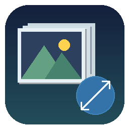
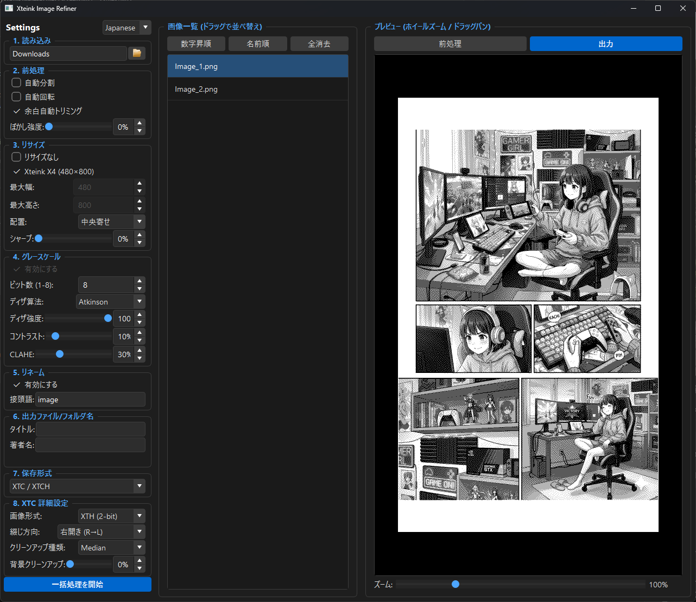

# Xteink Image Refiner

<p align="center">
  
</p>

**[English README](README.md)**

一款为电子书阅读器（特别是 Xteink 电子纸设备）优化和转换漫画/扫描图像的桌面应用程序。

## 特点

- **多种输入方式**：支持从文件夹、ZIP 压缩包或单个图像文件加载，支持添加多个来源
- **图像处理流程**：白边裁剪 → 自动旋转 → 模糊 → 缩放 → 锐化 → 灰度 → CLAHE → 对比度 → 抖动 → 清洁
- **丰富的输出格式**：JPEG / PNG（文件夹、ZIP、CBZ）、EPUB3、XTC / XTCH（Xteink 专有格式）
- **实时预览**：通过缩放/平移查看处理结果，支持预处理/输出两种模式切换
- **自动白边检测与手动调整**：可拖拽裁剪框微调
- **自动分割**：根据宽高比自动将跨页图像分割为两半
- **抖动算法**：支持 Floyd-Steinberg / Atkinson / Sauvola 算法（1bit / 2bit / 8bit）
- **设备预设**：内置 Xteink X3 (528x792) 和 X4 (480x800) 分辨率预设
- **不缩放模式**：用于图像排序、重命名和打包
- **元数据自动提取**：从文件夹/ZIP 名称中自动提取 `[作者] 标题` 格式信息
- **日语 / 英语 UI**：可在设置界面切换语言
- **设置持久化**：所有设置自动保存到注册表，下次启动时恢复

## 截图



## 运行环境

- Windows 10 / 11
- 预编译的 exe 文件位于 `dist/XteinkImageRefiner.exe`（独立运行，无需安装）

## 使用方法

### 从 exe 启动（推荐）

双击 `dist/XteinkImageRefiner.exe` 即可使用。

### 从 Python 启动

```bash
pip install PySide6 Pillow opencv-python numpy
python main.py
```

输出位置：`dist/XteinkImageRefiner.exe`

## 基本流程
1. **加载图像** — 点击“打开文件夹”或拖拽到图像列表，也可直接加载 ZIP 文件
2. **调整设置** — 在实时预览中调整缩放、灰度、抖动、清洁等参数
3. **输出** — 选择保存格式（单张图像 / EPUB3 / XTC），点击“开始转换”批量输出

##构建
可使用 PyInstaller 构建独立的 exe 文件：

```bash
pip install pyinstaller
python -m PyInstaller XteinkImageRefiner.spec
```
输出位置：dist/XteinkImageRefiner.exe

## 专有格式规格
Xteink 设备使用的 XTG / XTH / XTC / XTCH 格式规格请参考以下文档：
- [XTC-XTG-XTH-XTCH.md](XTC-XTG-XTH-XTCH.md)（English）
- [XTC-XTG-XTH-XTCH_jp.md](XTC-XTG-XTH-XTCH_jp.md)（日本語）
- [XTC-XTG-XTH-XTCH_zh-cn.md](XTC-XTG-XTH-XTCH_zh-cn.md)（简体中文）

## 更新日志
### 2026-04-04
- 增加设备预设选择（Xteink X3 528x792 / X4 480x800），替换旧的 X4 复选框
- 修复 ZIP 解压时的路径遍历漏洞
- 提高白边检测线程的停止可靠性
- 使用 NumPy 向量化运算优化 XTH 保存速度
- 增加了简体中文，繁体中文翻译

### 2026-03-08
- 增加日语 / 英语 UI 语言切换功能
- 改进作者名自动填充（未检测到时留空，不再设为“未知”）

### 2026-03-01
- 首次发布

## 备注
本项目使用 [Claude Code](https://claude.ai/code)（Anthropic）、[DeepSeek](https://deepseek.com)辅助生成和开发。

## 许可证
[MIT License](LICENSE)
